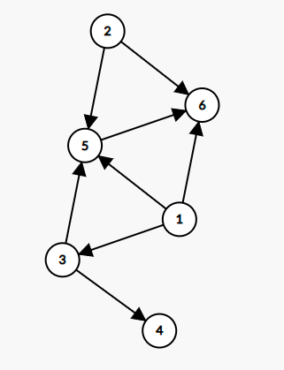

# [图](https://leetcode.cn/leetbook/read/graph/r3cr3r/)
##「图」的类型
「图」的类型有很多，本 Leetbook 中我们将介绍三种类型的图：无向图、有向图、加权图。

### 无向图
「无向图」的图中任意两个顶点之间的边都是没有方向的。

「图1. 小A的朋友交际图」是一个无向图。

### 有向图
「有向图」的图中任意两个顶点之间的边都是有方向的。

「图 2. 有向图的示例图」是一个有向图。

## 「图」的存储
###  邻接矩阵  n * n

```
[null, null, true, null, true, true]
[null, null, null, null, true, true]
[null, null, null, true, true, null]
[null, null, null, null, null, null]
[null, null, null, null, null, true]
[null, null, null, null, null, null]
```

### 邻接表
```
[1,3,5,6]
[2,5,6]
[3,4,5]
[5,6]
```
### 并查集

### 图的深度优先算法

### 图的广度优先算法